# About the project

Veterinary web application that reads and writes data from/to a database.

*Core Veterinarios web app* allows to create new users and validate a login with the backend side, as well as to consult the stock of the products or the differents features of the clients stored in the platform.

-Used technologies: Java, Java EE, JPA, SQL, HTML, CSS (& framework Bootstrap 4.1), Javascript

# App Screen
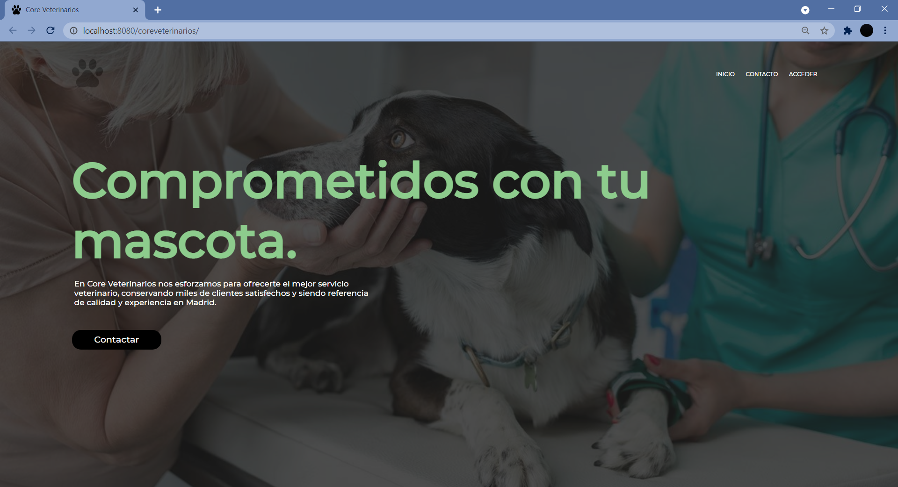
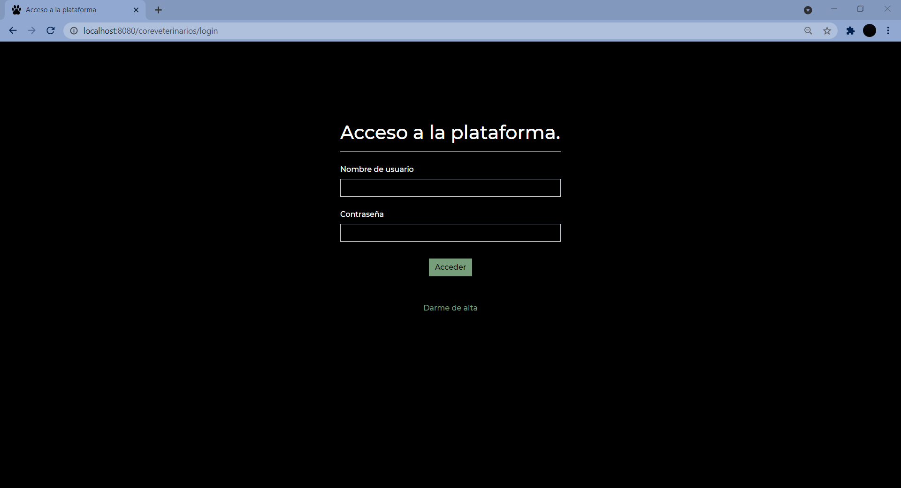
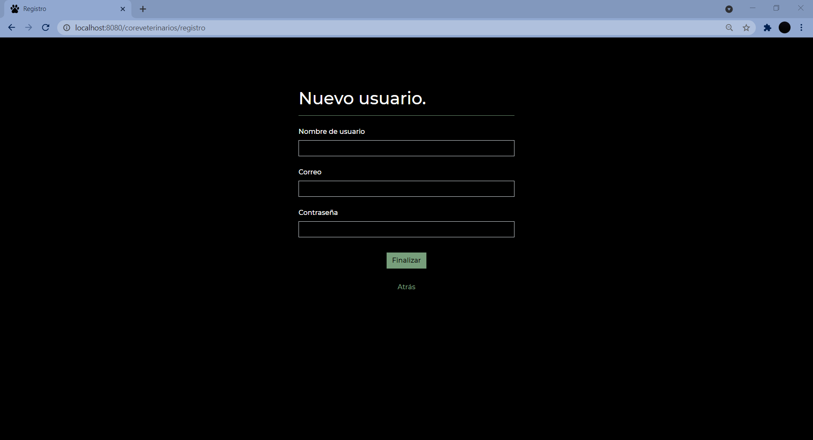
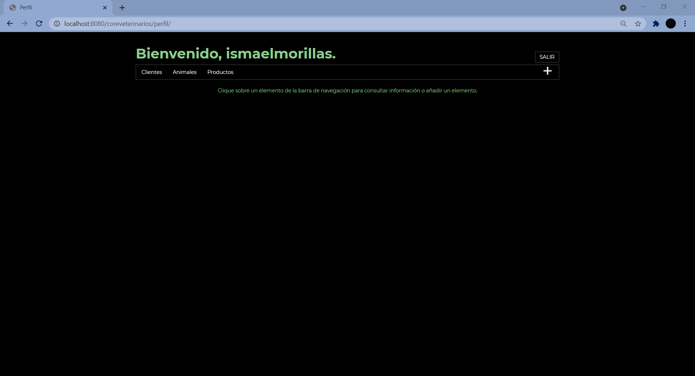
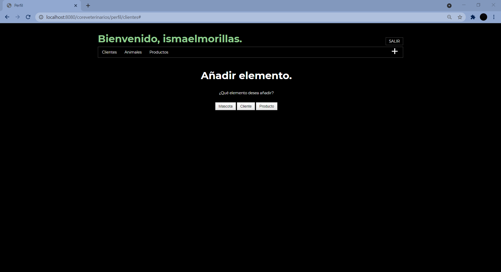
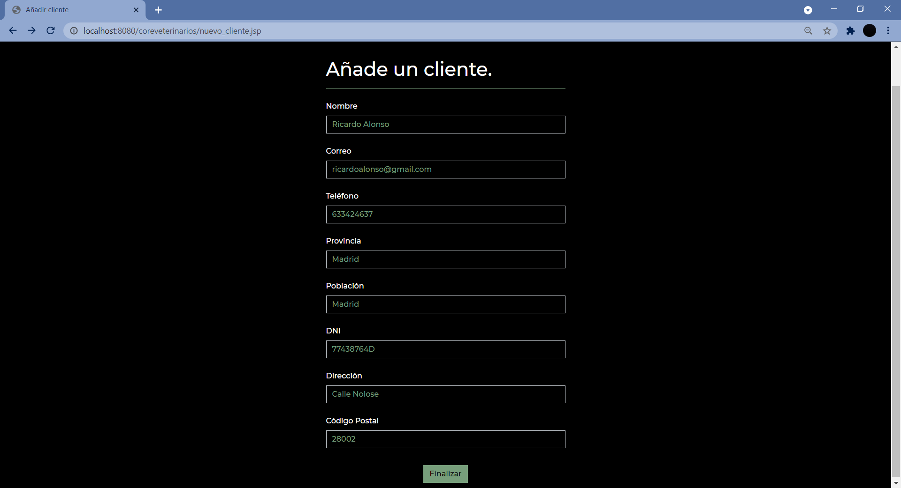
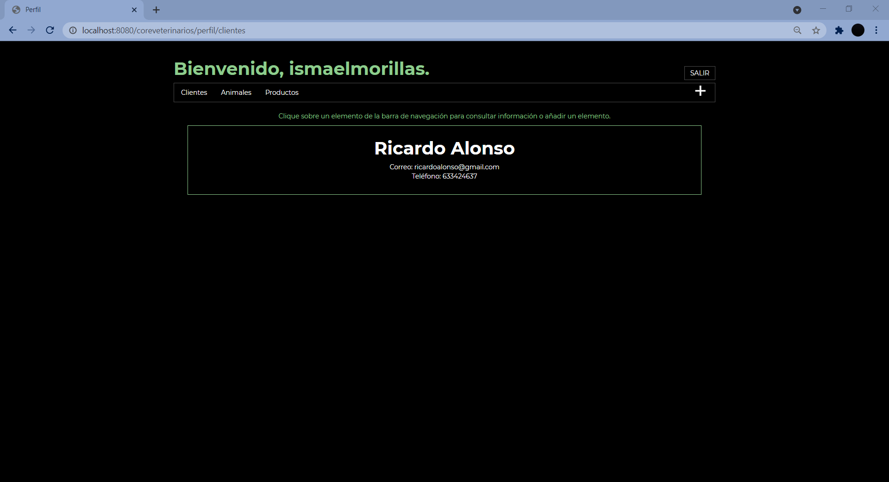
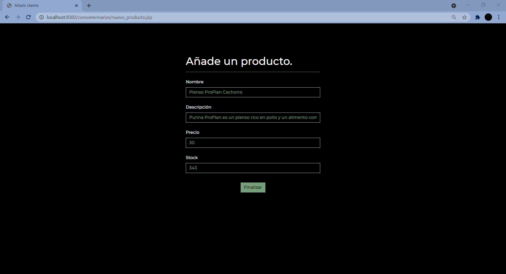
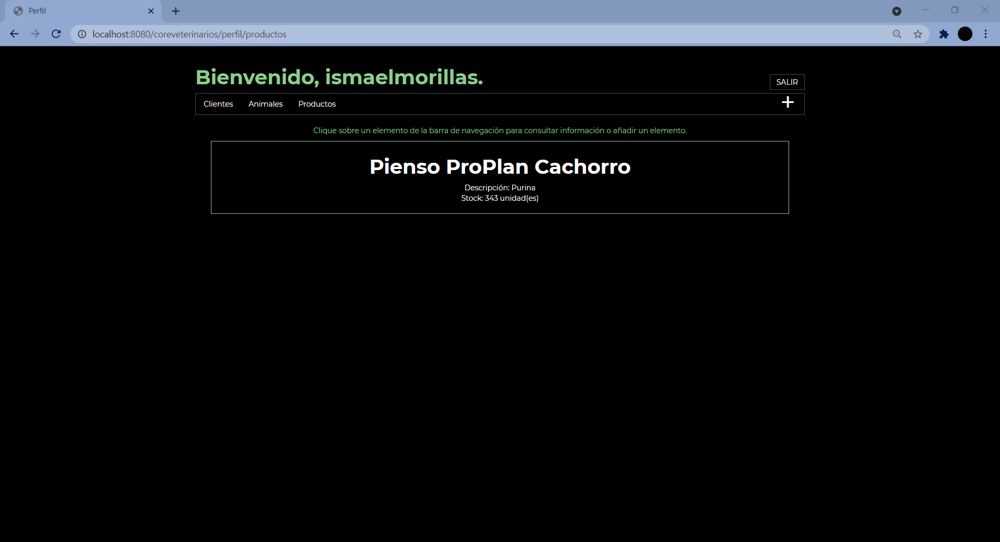
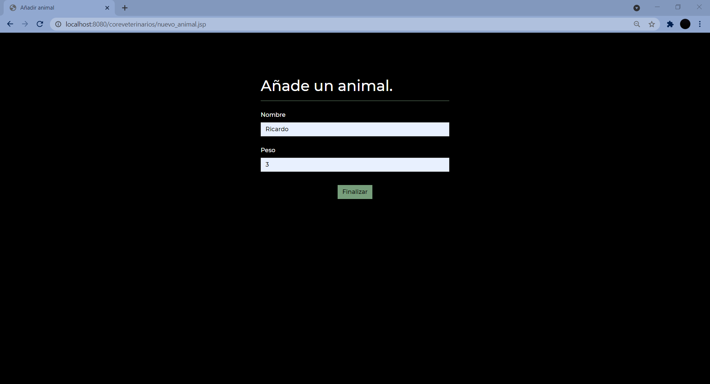
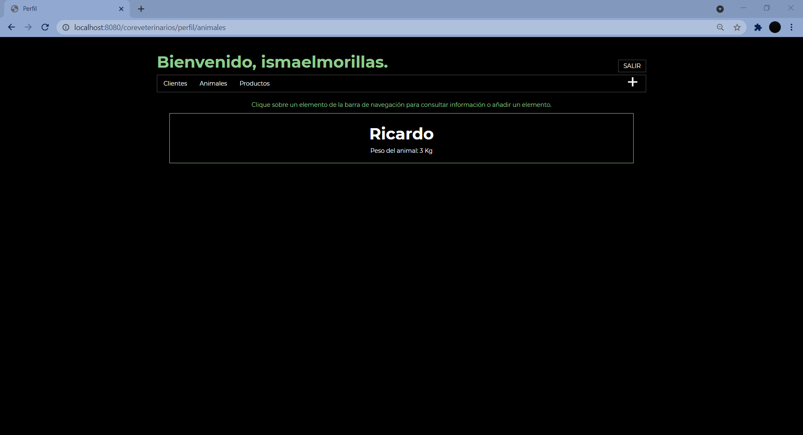
